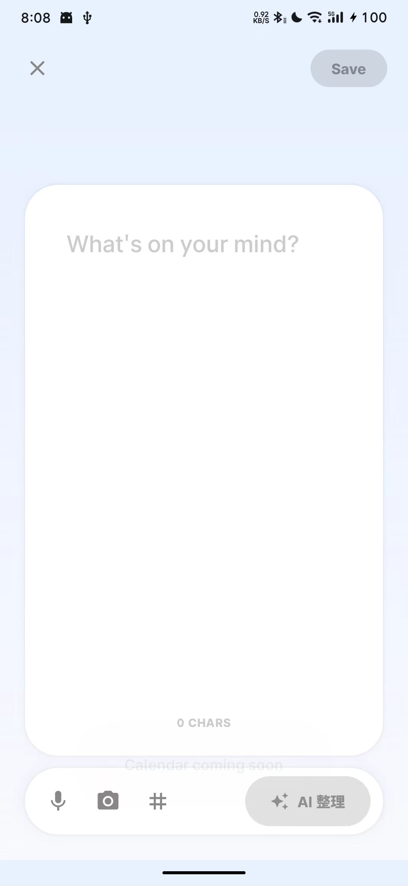
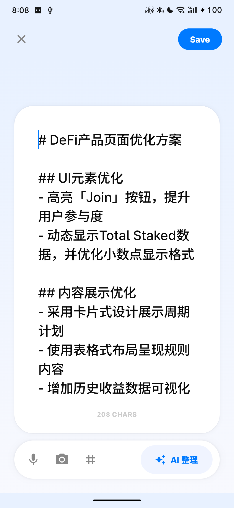
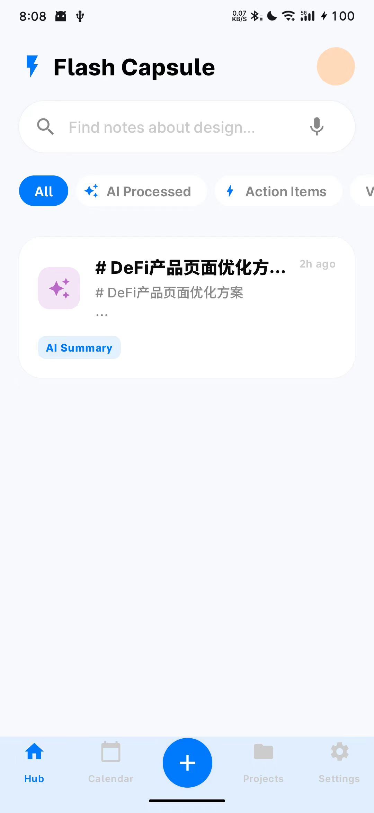

# AIbomm - AI 闪念胶囊

AIbomm 是一款基于 Android 平台的智能笔记与灵感捕捉工具。它结合了现代化的 UI 设计语言与强大的 AI 整理能力，旨在帮助用户快速捕捉碎片化灵感，并自动将其整理为结构清晰的专业笔记。

## ✨ 功能亮点

- **🚀 灵感快速捕捉**：
  - 支持文字、语音、图片多种输入方式。
  - 沉浸式输入界面，专注于灵感本身。
- **🤖 AI 智能整理**：
  - **一键整理**：将凌乱的随手记一键转化为逻辑通顺的专业笔记。
  - **智能总结**：自动提取核心摘要，并推断用户意图（如创建日程）。
  - **多模态解析**：深度集成 AI API，支持复杂内容的结构化处理。
- **🎨 精致桌面小组件**：
  - **1x1 灵感球**：类图标设计，高级渐变质感，一键直达捕捉界面。
  - **4x1 工具条**：超薄无边框设计，极致简约，支持快速文字/语音/相机输入。
  - **2x2 预览窗**：实时展示最新灵感，支持侧滑删除与快速编辑。
- **📱 现代化交互**：
  - 完全基于 Jetpack Compose 构建，拥有流畅的动画与 Material 3 设计风格。
  - 深度优化的 Swipe-to-Dismiss 列表操作。

## 🛠 技术栈

- **UI 框架**：Jetpack Compose (Material 3)
- **架构模式**：MVVM + Clean Architecture
- **本地存储**：Room Database
- **网络通信**：Retrofit + OkHttp + Kotlin Serialization
- **异步处理**：Kotlin Coroutines & Flow
- **AI 集成**：Digital Ocean AI API (Claude 3.7 Sonnet)

## ⚙️ 环境配置

1. **获取 API Key**：
   在根目录下创建 `.env` 文件，并配置您的 AI API 密钥：
   ```env
   DO_AI_API_KEY=您的API密钥
   DO_AI_MODEL=anthropic-claude-3.7-sonnet
   ```

2. **编译环境**：
   - Android Studio Iguana 或更高版本
   - JDK 17
   - Android SDK 34+

## 📸 预览

<div align="center">
  
  
  
</div>

*(AIbomm 预览图)*

## 📄 开源协议

MIT License
